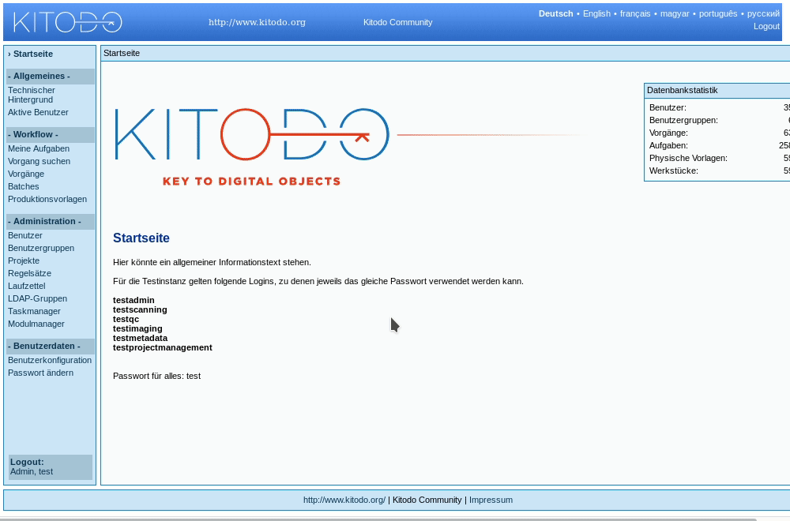

[kitodo-tutorials](../README.md) » [kitodo2](README.md) » 03_benutzerkonfiguration.md

# Benutzerkonfiguration

Neben der Verwaltung von Zugriffsbeschränkungen dient die Verwendung von unterschiedlichen Benutzergruppen auch einer besseren Usability bei der Durchführung einzelner Arbeitsschritte in Kitodo.Production. Es ist möglich, eine Benutzergruppe an eine Aufgabe im Workflow zu koppeln, so dass beispielsweise ein/e Scanoperator/in in der Aufgabenübersicht nur diejenigen offenen Vorgänge präsentiert bekommt, die sich im Arbeitsschritt Scannen befinden. Das sorgt versehentlicher Fehlbedienung vor und verbessert die Übersichtlichkeit.

Wir legen zunächst die Benutzergruppen sowie eine Reihe von Benutzern für den Workshop an. Die Zuordnung von Berechtigungen erfolgt später in der Workflowkonfiguration. Auch für diesen Schritt werden Administrationsrechte benötigt:

- Login: `testAdmin`
- Passwort: `test`

## Aufgabe: Benutzergruppen anlegen

Auf dem Demo-Server sind die Benutzergruppen bereits eingerichtet. Wenn Sie mit einer lokalen Installation arbeiten, gehen Sie wie folgt vor:

- Menüpunkt Administration / `Benutzergruppen` aufrufen, dort Link `Neue Benutzergruppe anlegen` klicken und folgende Angaben vornehmen:
  - Titel: `Administration`
    - Berechtigung: `Admin`
  - Titel: `Scanning`
    - Berechtigung: `Einfache Nutzerberechtigung`
  - Titel: `Metadata`
    - Berechtigung: `Einfache Nutzerberechtigung`
  - Titel: `Projectmanagement`
    - Berechtigung: `Verwaltung`

## Aufgabe: Benutzer anlegen

* Menüpunkt Administration / `Benutzer` aufrufen, dort Link `Neuen Benutzer anlegen` klicken und folgende Angaben vornehmen:
  * Technische/r Administrator/in
    * Nachname: `workshop20180611`
    * Vorname: `admin`
    * Standort: `berlin`
    * Login: `workshop20180611admin` 
    * Passwort: `test`
    * LDAP-Gruppe: `Kitodo Zeutschel GmbH`
    * Sprache für Metadaten: `de`
    * Benutzergruppen: `Administration`
    * Projekte: `Workshop20180611`
  * Scanoperator/in
    - Nachname: `workshop20180611` 
    - Vorname: `scanning`
    - Standort: `berlin`
    - Login: `workshop20180611scanning` 
    - Passwort: `test`
    - LDAP-Gruppe: `Kitodo Zeutschel GmbH`
    - Sprache für Metadaten: `de`
    - Benutzergruppen: `Scanning`
    - Projekte: `Workshop20180611`
  * Metatadaten-Expert/in
    - Nachname: `workshop20180611`
    - Vorname: `metadata`
    - Standort: `berlin`
    - Login: `workshop20180611metadata`
    - Passwort: `test`
    - LDAP-Gruppe: `Kitodo Zeutschel GmbH`
    - Sprache für Metadaten: `de`
    - Benutzergruppen: `Metadata`
    - Projekte: `Workshop20180611`
  * Projektmanager/in
    - Nachname: `workshop20180611`
    - Vorname: `projectmanagement`
    - Standort: `berlin`
    - Login: `workshop20180611projectmanagement`
    - Passwort: `test`
    - LDAP-Gruppe: `Kitodo Zeutschel GmbH`
    - Sprache für Metadaten: `de`
    - Benutzergruppen: `Projectmanagement`
    - Projekte: `Workshop20180611`
* Anschließend muss noch für jede/n Benutzer/in die Konfiguration manuell an die LDAP-Nutzerdatenbank übermittelt werden.
  * Im Menüpunkt Administration / `Benutzer` den Button `Benutzer bearbeiten` klicken
  * Neben dem Textfeld `LDAP-Gruppe` den Button `LDAP-Konfiguration schreiben` (Schlüsselsymbol) klicken.

## Hinweise

* In der Standardkonfiguration nutzt Kitodo.Production eine eigene Nutzerdatenbank anstelle von LDAP. Die Einstellung wird in Kitodo.Production 2.1 in der Datei [goobi_config.properties ab Zeile 518](https://github.com/kitodo/kitodo-production/blob/56ae1cd8962ef1b64dfcee4a503533331b90f614/Goobi/config/goobi_config.properties#L518)  vorgenommen.

## Literatur

* Anwenderdokumentation: [Benutzergruppen](https://github.com/kitodo/kitodo-production/wiki/Benutzergruppen), [Benutzer](https://github.com/kitodo/kitodo-production/wiki/Benutzer)

------

Vorige Seite: <a href="02_projekt-anlegen.md">2. Projekt anlegen</a> | Nächste Seite: <a href="04_produktionsvorlage-anlegen-und-workflow-definieren.md">4. Produktionsvorlage anlegen und Workflow definieren</a>

