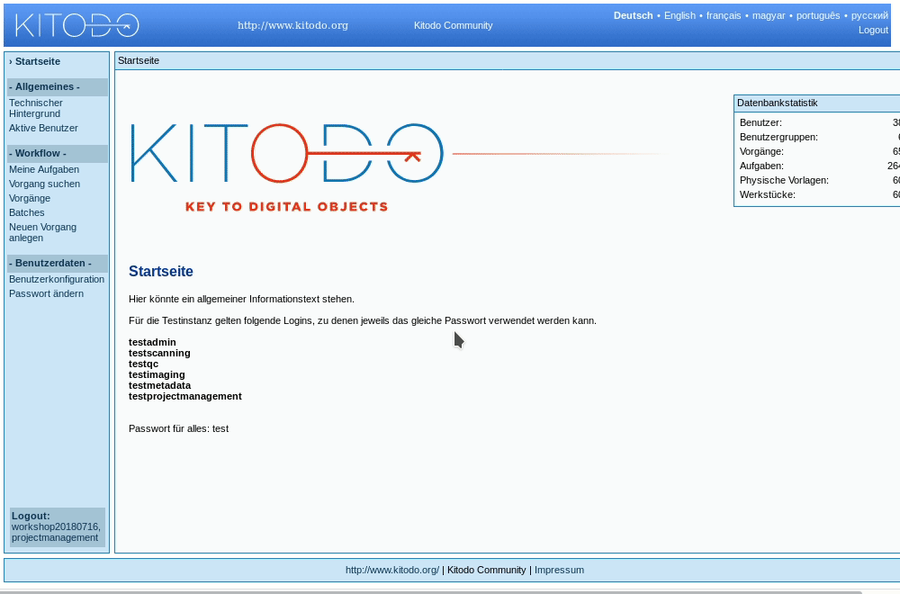

[kitodo-tutorials](../README.md) » [kitodo2](README.md) » 05_vorgaenge-anlegen.md

# Vorgänge anlegen

Im Workshop scannen wir folgende von der TU Berlin bereitgestellte Materialien:

- ABC der Blumen-Sprache (1814, Fraktur, 16 S.): [Katalog](http://gateway-bayern.de/BV042554518), [Digitalisate](http://ubsrvgoobi2.ub.tu-berlin.de/viewer/resolver?urn=urn%3Anbn%3Ade%3Akobv%3A83-goobi-1917755)
- Anleitung zum gärtnerischen Planzeichnen [Tafeln] (1898, 16 Bl.): [Katalog](http://gateway-bayern.de/BV024154091), [Digitalisate](http://ubsrvgoobi2.ub.tu-berlin.de/viewer/resolver?urn=urn%3Anbn%3Ade%3Akobv%3A83-goobi-923735)
- Das Strauch- und Schalenobst (1920, 48 S., 8. Bl.): [Katalog](http://gateway-bayern.de/BV024453565), [Digitalisate](http://ubsrvgoobi2.ub.tu-berlin.de/viewer/resolver?urn=urn%3Anbn%3Ade%3Akobv%3A83-goobi-3224575)
- Rosenbuch für jedermann (1901, 128 S.): [Katalog](http://gateway-bayern.de/BV024298517), [Digitalisate](http://ubsrvgoobi2.ub.tu-berlin.de/viewer/resolver?urn=urn%3Anbn%3Ade%3Akobv%3A83-goobi-3244471)
- The Florist's journal [Jg. [4.]1843, Heft 1-6] (120 S.): [Katalog](http://gateway-bayern.de/BV043427235), [Digitalisate](http://ubsrvgoobi2.ub.tu-berlin.de/viewer/resolver?urn=urn%3Anbn%3Ade%3Akobv%3A83-goobi-2516979)

Normalerweise werden die Metadaten des zu digitalisierenden Werkes über die Assistenzfunktion "Suche im Opac" über eine Schnittstelle direkt in die entsprechenden Felder in Kitodo.Production übernommen. Für die hier verwendeten Materialien der TU Berlin kann diese Assistenzfunktion jedoch nicht verwendet werden, weil die Materialien nur in den Katalogen des KOBV und des B3Kat verzeichnet sind und Kitodo.Production bislang nur Schnittstellen zu den Katalogen vom GBV, SWB, Kalliope und der ZDB anbietet. Die Daten müssen daher ausnahmsweise manuell aus den oben verlinkten Katalogen übertragen werden.

Für diesen Schritt werden Verwaltungsrechte benötigt. Sie können den in Schritt [3. Benutzerkonfiguration](03_benutzerkonfiguration.md) angelegten Account für das Projektmanagement verwenden.

## Aufgabe: Vorgang anlegen

- Menüpunkt Workflow / `Neuen Vorgang anlegen` aufrufen
  - Wenn es nur eine Produktionsvorlage im Projekt gibt, dann landen Sie direkt im Bildschirm "einen neuen Vorgang anlegen". Wenn es mehrere Produktionsvorlagen in einem Projekt gibt, dann erscheint eine Liste dieser Produktionsvorlagen. Klicken Sie in diesem Fall in der passenden Zeile in der Spalte Aktionen auf den Button "Einen Vorgang auf Basis dieser Produktionsvorlage anlegen".
  - Erstellen Sie einen neuen Vorgang für das auf Ihrem Handzettel notierte Material (also nur für eins der fünf oben vermerkten Materialien).
  - Im `Vorgangstitel` bitte die Nummer aus dem Handzettel vornewegstellen, etwa so `02_abc-blumen-sprache_BV042554518`, damit wir die Vorgänge im Workshop auseinanderhalten können.
  - Lesen Sie zur Einführung die Anwenderdokumentation [Neuen Vorgang anlegen](https://github.com/kitodo/kitodo-production/wiki/Neuen-Vorgang-anlegen) im Wiki und füllen Sie dann die Felder anhand der oben verlinkten Katalogeinträge aus.

## Aufgabe: Laufzettel drucken

Direkt im Anschluss an das Anlegen des Vorgangs erhalten Sie die Möglichkeit einen Laufzettel auszudrucken. Sie erreichen die Funktion auch über die Vorgangsliste.

Drucken Sie den Laufzettel aus. Er enthält einen Barcode, der vom Scanner eingelesen werden kann.

## Hinweise

* Der Menüpunkt `Neuen Vorgang anlegen` steht Accounts mit Administratorrechten nicht zur Verfügung. Hier ist der einfachste Weg über das Menü Workflow / `Produktionsvorlagen` und dort über den mittleren Aktionsbutton `Einen Vorgang auf Basis dieser Produktionsvorlage anlegen`.
* Die Auswählmöglichkeiten im Feld "Digitale Kollektionen" werden über eine [XML-Datei](https://github.com/kitodo/kitodo-production/wiki/Digitale-Kollektionen-%28XML-Datei%29) gesteuert.
* Die TIF-Header sind aktuell in Kitodo.Production noch ohne Verwendung. Die Daten landen aber in der Vorlagendatei und stünden für externe Tools zur Verfügung.

## Literatur

* Anwenderdokumentation Vorgang: [Neuen Vorgang anlegen](https://github.com/kitodo/kitodo-production/wiki/Neuen-Vorgang-anlegen), [Vorgangsdetails](https://github.com/kitodo/kitodo-production/wiki/Vorgangsdetails), [Vorgangsdetails Physische Vorlagen](https://github.com/kitodo/kitodo-production/wiki/Vorgangsdetails---Physische-Vorlagen) und [Vorgangsdetails Werkstückeigenschaft](https://github.com/kitodo/kitodo-production/wiki/Vorgangsdetails---Werkst%C3%BCckeigenschaft)
* Anwenderdokumentation [Laufzettel](https://github.com/kitodo/kitodo-production/wiki/Laufzettel)

------

Vorige Seite: <a href="04_produktionsvorlage-anlegen-und-workflow-definieren.md">4. Produktionsvorlage anlegen und Workflow definieren</a> | Nächste Seite: <a href="06_scannen.md">6. Scannen</a>

